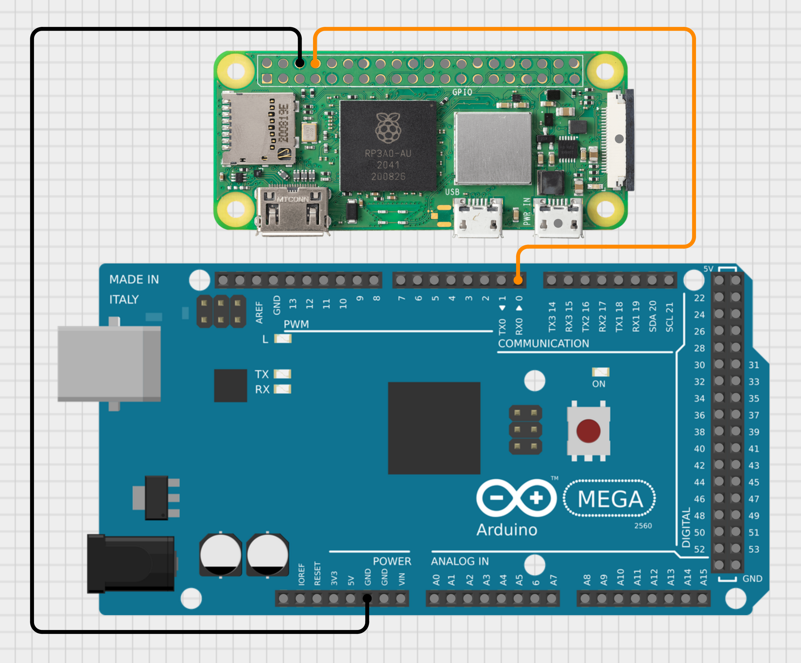

RACER – Raspberry & Arduino Car for Environmental Recognition

- Introduzione
    Il progetto RACER si incentra sullo sviluppo da zero di una macchina a guida autonoma grazie alla combinazione del Microcontrollore Arduino Mega 2560 R3 (prodotto dalla Elegoo), il Microcomputer Raspberry Pi Zero 2W e il Modello Convoluzionale YoloV5s. 
    Sebbene non si tratti di una classica RC-Car, l'idea principale è sostituire il controllo umano e il Radiocomando con un sistema basato su una rete neurale e sulla computer vision tramite OpenCV. Questo sistema è in grado di osservare l'ambiente, rilevare enti e segnali stradali e analizzare le corsie per correggere automaticamente la direzione del veicolo.

- Fase di progettazione HardWare
    Un primo approccio ha portato il team ad utilizzare un ESP32-S3-N16R8 in combinazione con una camera OV5560. Purtoppo la bassa potenza di calcolo e la qualità costruttiva ci ha portato a sostituirlo con un Raspberry, in particolare l'antenna wifi era debole, i contatti della camera estremamente sensibili che portavano a un degrado delle prestazioni con minimi movimenti e il corpo macchina della OV5560 tendeva a surriscaldarsi molto velocemente portando a un ulteriore degrado delle prestazioni.

- Arduino - Il cuore
    Alla base di ogni autovettura c'è sempre un motore, per RACER sono state utilizzati 4 piccoli motori DC a bassa tensione (9v) che possono essere controllati con i pin PWM di Arduino. In particolare la struttura è 4WD (Four Wheel Drive), ovvero a trazione integrale dove ogni ruota è motrice e può essere impostata autonomamente.
    A disposizione avevamo un solo L293D (dual H-Bridge motor driver) per il controllo di direzione e velocità, sono quindi stati collegati in serie i 2 motori di destra e di sinistra. Ciò semplifica anche la gestione della svolta poichè per sterzare è necessario che i due motori di ambi i lati abbiano velocità equivalenti. I comandi che verranno gestiti sono Start, Stop, Sterzata a destra e sinistra e variazione di velocità a due livelli.
    è stato inserito anche uno schermo LCD 16x2 che funge da debugger per comprendere in tempo reale cosa sta facendo l'Arduino.
    Il "telaio" è in resina con ruote in gomma/plastica.

- Raspberry + PiCamera - Gli occhi della macchina
    Per catturare ... abbiamo utilizzato un Raspberry Pi Z2W, dotato di processore Quad-core Cortex-A53 a 1.0 GHz a 64bit e 512MB LPDDR2 di RAM, in combinazione con una PiCamera V2 che monta un sensore Sony IMX219 da 8 Megapixel. Entrambi i componenti sono stati montati in un case apposito della Raspberry mostrato in figura e montato nella parte anteriore del veicolo.
    Questo modulo si occuperà di:
     1. Catturare un flusso video 720x1280 e streammarlo su una rete locale (Hotspot Cellulare). Lo streaming sarà in contemporanea catturato mediante OpenCV su un PC che sta eseguendo il programma principale di analisi ambientale. 
     2. Gestire connessioni TCP con un terminale per lo scambio di messaggi.
     3. Inoltro dei comandi ad Arduino.

- Comunicazione tra i moduli
   1. Il PC collegato alla stessa rete del Raspberry cattura con OpenCV lo streaming video. 
   2. Con la libreria Socket invierà i comandi/messaggi utilizzando il protocollo TCP su porta 5005 al Raspberry.
   3. Una volta ricevuti, il Raspberry li inoltrerà all'Arduino tramite il collegamento UART0 (Universal Asynchronous Receiver-Transmitter) che permette lo scambio su porta seriale in modo asincrono. 

   4. Streaming Video Raspberry
    Abbiamo creato un'app WebCamera Server utilizzando il framework Flask e le librerie PiCamera2 e OpenCV per catturare i frame dalla PiCamera. L'app si occupa di inviare il flusso di frame catturato dalla camera al dispositivo connesso su porta 8080.

- Alimentazione
 1. Arduino: Batteria 9v
 2. Motori: Batteria 9v
 3. Raspberry: Powerbank 5V/1A

- Fase di progettazione SoftWare

Il sistema di percezione
- YOLOv5 
    - Cosa è yolov5
    - perchè lo abbiamo scelto
    - spiegazione fase training con immagini
    # inserire immagini relative a addestramento precisione ecc
    - spiegazione cosa fa yolo 

- Lane detection

- Navigazione autonoma (descrizione del codice per riconoscimento segnali e corsia)

- Sviluppi futuri del progetto
  Rapberry pi 5 per eseguire modello
  camera migliore
  ecc...

Linkss porcoddio
https://www.raspberrypi.com/products/camera-module-v2/
https://www.raspberrypi.com/products/raspberry-pi-zero-2-w/
https://eu.elegoo.com/it-it/products/elegoo-mega-2560-r3-board?srsltid=AfmBOoqlCYHo64N17LxwVv7XPuF1ZlfI-sFE9XTx8FvvoUylTrOLYtfg
https://www.raspberrypi.com/documentation/computers/camera_software.html

https://github.com/ultralytics/yolov5
https://docs.ultralytics.com/it/models/yolov5/

https://app.roboflow.com/yolorc-rrbm0/road-object-detection-v081a/7

https://www.geeksforgeeks.org/multithreading-python-set-1/

# Reminder:

    - Sassari
    - Sta macchina fa tempi migliori di Stroll
